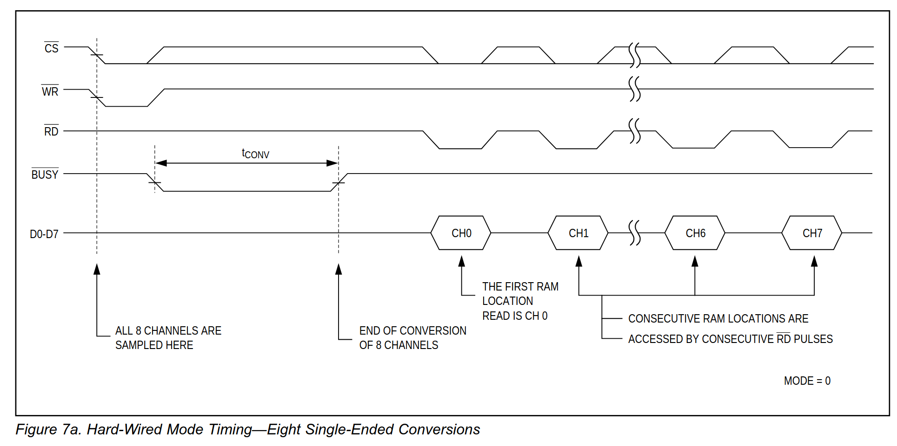
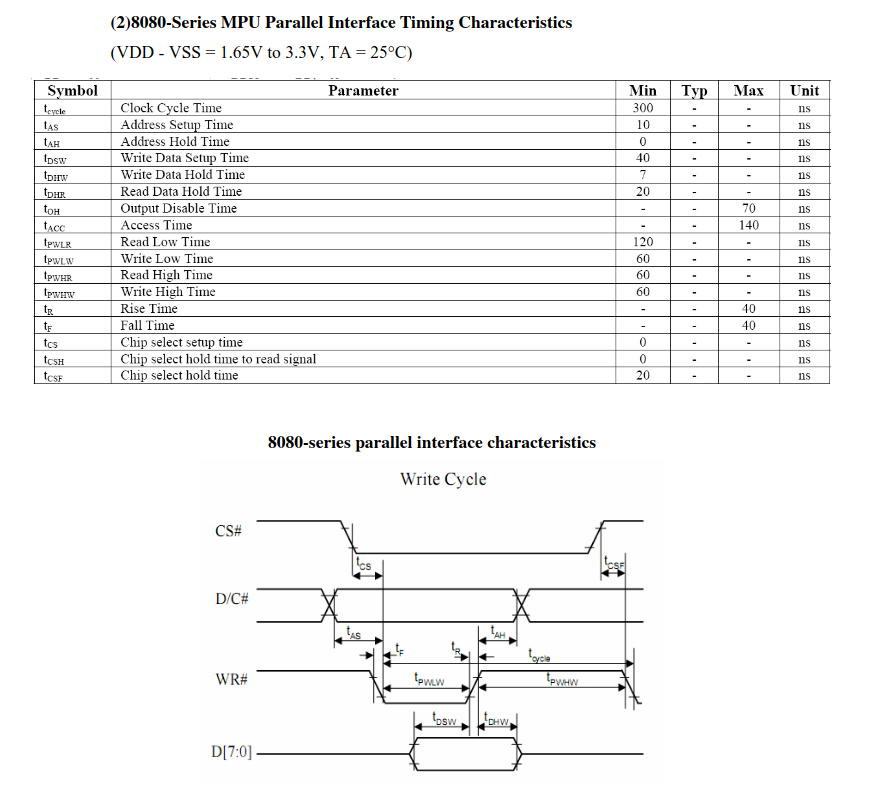

# Byggern
Supply voltage from supply is 8-12V

## Terminal setup
Connect VGA cable to PC, that's the RS that communication uses.
Run: minicom -D /dev/ttyS0 to start logging.
Set baud to 9600 and 7N1.

For ATSAM, unplug and replug the Atmel ICE if you have errors building. It might be registered as new device.
dmesg --follow to see.

## Task 1
- Made USART support
- 9600 7N1 (7 databits, 1 stop bit)

## Task 2
 - Components
   - Latch ( 74ALS573 )c
   - 
   - SRAM IC ( IDT 7164 S20TPG)
   - A/D Converter
   - LCD display
   - Adress latch ( STK501 )
 - DEBUG
   - Latch-Enable (orange wire, LE) high --> Q=D. LE low --> Q is latched.
   - 

## Task 3
 - ADC
  - Vdd = 22
  - Vss = 4
  - CS = 5. CHIP SELECT Input must be low for the ADC to recognize RD, or WR.
  - RD = 6
  - WR = 7

  - It does not need any address lines as it will only
    receive data on the data bus, but it will need a chip select signal derived from the address bus using the address decoder implemented in the previous exercise.

  - The MAX156 does not have an
    internal clock, and require an external clock signal to work properly.

  - Conversions are initiated with a pulse to the WR pin, and data
    is accessed from the ADC’s RAM with a pulse to the RD pin.
  
  - To access conversion results, successive RD pulses auto-
    matically sence through RAM, beginning with channel 0.
    Each RD pulse increments the RAM address counter,
    which resets to 0 when WR goes low in multi channel
    conversions. An arbitrary RAM location may also be read
    by writing a 1 to INH while loading the RAM address (A0–
    A2), and then performing a read operation.

  - A PWM signal from the AtMega162 can be used as the ADCs external clock. Use PD4 or
    PD5 to avoid conflicts for later exercises.

  - Hard-wired connections of MODE and VSS select from 4 mux configurations as listed
    in Table 4 (see the Hard-Wired Mode section).

  - Configuration
    - MODE = 0, VSS = AGND (AGND is the ground potential, just connect it to GND on the     breadboard)

  - tCONV = (9 x N x 2)/fCLK
    where N is the number of channels converted.

    - 

- Left slider --> PWM PB4 
- Right slider --> PWM PD1

- Left button --> PB5
- Right button --> PD0

Filter setup
- PWM PB4 --> Input Filter pin 1 
- PWM PD1 --> Input Filter pin 5
- Output filter 1 --> Grey conductor to AIN2
- Output filter 2 --> Blue conductor to AIN3 

ADC setup
- Joystick Pin 1 --> AIN0
- Joystick Pin 2 --> AIN1
- Left Slider Pin 1 --> AIN2
- Right Slider Pin 2 --> AIN3

Joystick:

OLED:
- Use 8080 parallell interface, might have to pin select it
- 

## Task 5
- SPI driver
  - The SPI Master initiates the
  communication cycle when pulling low the Slave Select SS pin of the desired Slave. Master and
  Slave prepare the data to be sent in their respective Shift Registers, and the Master generates
  the required clock pulses on the SCK line to interchange data. Data is always shifted from Mas-
  ter to Slave on the Master Out – Slave In, MOSI, line, and from Slave to Master on the Master In
  – Slave Out, MISO, line. After each data packet, the Master will synchronize the Slave by pulling
  high the Slave Select, SS, line.
  
  - Procedure
    - Set SS'low
    - Write byte to SPDR (SPI Data Register). This starts the SPI clock generator.
    - After shifting one byte, the SPI clock generator stops, setting the End of
      Transmission Flag (SPIF). If the SPI Interrupt Enable bit (SPIE) in the SPCR Register is set, an
      interrupt is requested. The Master may continue to shift the next byte by writing it into SPDR, or
      signal the end of packet by pulling high the Slave Select, SS line.
    - The last incoming byte will be kept in the buffer register for later use.
  
- The system is single buffered in the transmit direction and double buffered in the receive direc-
  tion. This means that bytes to be transmitted cannot be written to the SPI Data Register before
  the entire shift cycle is completed. When receiving data, however, a received character must be
  read from the SPI Data Register before the next character has been completely shifted in. Oth-
  erwise, the first byte is lost.

## MCP2515
- The MCP2515 expects the first byte after lowering CS to be the instruction/ command byte. This implies that CS must
  be raised and then lowered again to invoke another command.

- It is highly recommended that the Reset command be sent (or the RESET pin be lowered) as part of the power-on
  initialization sequence.

## Task 5
CAN communication Node 2
  - 8 independent message objects (mailboxes) are implemented. These are buffers or channels. 
  - We communicate via the user interface to the mailboxes, i.e. mb configuration, reads and writes.
  - All controllers on a CAN bus must have the same bit rate and bit length.
  - The CAN_BR register defines the sampling pint in the bit time period. CAN_BR must be set before the CAN controller is enabled by setting the CANEN field in the
    CAN_MR register.
  - Once the CAN controller is enabled, bus synchronizaton is done automatically.

## Task 6
Servo out pins
  - Signal = Arduino D21 = Atmel SAM3X8E PB13
  - Printing in console
    - Make sure that Baud Rate is the same as specified in uart_init().
    - to print in console run "sudo minicom -D /dev/ttyACM0"

## NOTE FROM 26.10.
  I ran into an issue where there is zero response from the Arduino board. Tested agains another group's board and that works. So think there is 
  a hardware problem on our board.